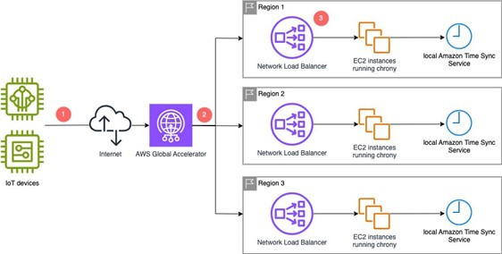
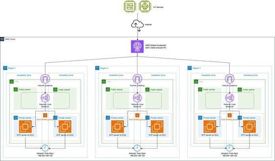

# Building a global, low-latency NTP service with static IP addresses
---
## Contents

- [Building a global, low-latency NTP service with static IP addresses](#building-a-global-low-latency-ntp-service-with-static-ip-addresses)
  - [Contents](#contents)
  - [Solution Overview](#solution-overview)
  - [Implementing a global, low-latency NTP service with static IP addresses](#implementing-a-global-low-latency-ntp-service-with-static-ip-addresses)
    - [Prerequisites](#prerequisites)
    - [Walkthrough](#walkthrough)
  - [Cleaning Up](#cleaning-up)
  - [Further Considerations](#further-considerations)
  - [Conclusion](#conclusion)
  - [Authors](#authors)
  - [Security](#security)
  - [License](#license)

---

As organizations continue to roll out cloud-connected Internet-of-Things (IoT) applications, the need for accurate and reliable time synchronization has become increasingly critical. Although Amazon Web Services (AWS) provides the [Amazon Time Sync Service](https://docs.aws.amazon.com/AWSEC2/latest/UserGuide/configure-time-sync.html) for basic Network Time Protocol (NTP) needs, some IoT scenarios need a custom NTP solution. For example, users want to serve many IoT devices with time synchronization services, while providing a fixed IP, being highly available, and having low latency. In this post, we explore how to build a global, low latency NTP service on AWS that meets these more specialized requirements.

Accurate time synchronization is essential in distributed computer systems and IoT applications. It is necessary for maintaining consistency and data integrity, and it enables the correct functioning of security mechanisms and protocols. Having reliable and accurate time is compulsory for validating certificates that IoT devices use to authenticate themselves in the cloud. Including an accurate timestamp with the IoT data is necessary to order the datapoints and enhances your analytic capabilities.

IoT applications in industrial environments, such as production plants or power plants, need strict control over connectivity. Only a few IP addresses and ports can be opened on firewalls for IoT devices for their external connectivity. In remote areas, IoT devices use high-latency and unreliable satellite network connections, which makes time synchronization challenging. Therefore, adding more latency must be avoided. Furthermore, when using battery-powered IoT devices, you might want to reduce the amount of network requests and CPU, thus eliminating DNS requests and using fixed IP addresses instead prolongs the battery life.

The IoT device suppliers want to deploy private dedicated NTP infrastructure to address these challenges and use cases. This post describes how to deploy a multi-[AWS Region](https://aws.amazon.com/about-aws/global-infrastructure/regions_az/), low latency, resilient, and global solution with a fixed IP, using [AWS Global Accelerator](https://aws.amazon.com/global-accelerator/) and Amazon Time Sync Service.

## Solution Overview

The following diagram illustrates an architecture for implementing a public NTP service using AWS services.



Figure 1: High level diagram for implementing a public NTP service over a static public IP

Figure 1 depicts the following data flow:
1.	 IoT devices send NTP requests to one of the two static IPs provided by Global Accelerator.
2.	Global Accelerator routes the request to the nearest Region.
3.	The [Network Load Balancer (NLB)](https://aws.amazon.com/elasticloadbalancing/network-load-balancer/) in that Region distributes the request to one of the [Amazon Elastic Compute Cloud (Amazon EC2)](https://aws.amazon.com/ec2/) instances running in an Auto Scaling group. The EC2 instance, running Chrony, processes the NTP request. Chrony on the EC2 instance uses the local Amazon Time Sync Service as its authoritative time source. Then, the accurate time is sent back to the IoT device.

## Implementing a global, low-latency NTP service with static IP addresses

These steps guide you through the process of deploying an NTP service using [AWS CloudFormation](https://aws.amazon.com/cloudformation/). CloudFormation is a service that helps you model and set up your AWS resources so that you can spend less time managing those resources and more time focusing on your applications that run in AWS. The procedure involves creating two CloudFormation stacks: 
* 1^st^ CloudFormation stack: 
  Deploys the NTP service in one or more AWS Regions, and the 
* 2^nd^ CloudFormation stack:
  Deploys a Global Accelerator to provide a global entry point for the NTP service. 

These steps make sure that you have the necessary AWS permissions, identify the deployment Regions, and provide instructions for creating the CloudFormation stacks and retrieving the necessary output values. 
The following diagram shows the complete solution when deployed:



### Prerequisites

The following prerequisites are necessary to follow this solution:

* An AWS account with appropriate permissions to create and manage the resources defined in the CloudFormation templates, such as the ability to create VPCs, subnets, security groups, EC2 instances, load balancers, and [AWS Identity and Access Management (IAM)](https://aws.amazon.com/iam/) roles and policies.
* For the second stack, you need permission to create Global Accelerator resources, such as Accelerators, Listeners, and Endpoint Groups.

### Walkthrough

The following steps walk you through this solution.
* **Step 1. Create the first CloudFormation stack for the NTP service in a chosen Region by following these steps**
    * Log in to the [AWS Management Console](https://aws.amazon.com/console/).
    * Choose the Region where you want to deploy the stack from the top right corner.
    * In the navigation pane, under **Management and Governance**, choose the **CloudFormation** service.
    * Choose **Create Stack** and select **With new resources (standard)**.
    * Select **Upload a template file** and provide the CloudFormation template file ([regional-NTP.yaml](regional-NTP.yaml)).
    * Provide the necessary parameter values, including the [Amazon Machine Image (AMI)](https://docs.aws.amazon.com/AWSEC2/latest/UserGuide/AMIs.html) ID and NTP server, and then proceed to the next step.
    o	AMI ID: The template uses an [AWS Systems Manager](https://aws.amazon.com/systems-manager/) parameter to retrieve the latest [Amazon Linux](https://aws.amazon.com/amazon-linux-2/) 2023 AMI ID. If you need to use a different AMI or newer AMI versions, you must update the AMI parameter accordingly. This is the latest Amazon Linux at the time of this writing.
    o	NTP Server: The template provides a default value of the local Amazon Time Sync Service, but you can change it if needed.
    * Note the stack's output, specifically the Amazon Resource Name (ARN) of the load balancer.
* **Step 2. Repeat Step 1 for each additional AWS Region where the NTP service is deployed**
    * Make sure to switch to the desired regions in the AWS Management Console when creating each stack. 
    * Note the ARN of the load balancer for each region in the Stack Outputs.
* **Step 3. After creating the stacks in the target Regions, switch to the us-east-1 Region and follow these steps to create the Global Accelerator stack**
    * Navigate to the CloudFormation service.
    * Choose **Create Stack**, and then choose **With new resources (standard)**.
    * Select Upload a template file and choose the CloudFormation template file for Global Accelerator ([global-NTP.yaml](global-NTP.yaml)).
    * Input the ARNs of the load balancers from the previously created stacks in the three Regions. The stack was written to support three AWS Regions, but it can be modified to support less or more AWS Regions based on your organization requirements.
    * Complete the creation of the stack. The output includes the DNS name and IP addresses of the Global Accelerator resources.
* **Step 4. Access the NTP service using the DNS name or IP addresses provided by the Global Accelerator stack's output**
    * In the Outputs section of the deployed CloudFormation stack, check the AcceleratorDNSName entry, similar to ab12345d67d89a101.awsglobalaccelerator.com.
    * To validate that the NTP server is responding, you can use the sntp command in a Linux machine and get output similar to the following:

    ```user@linux-machine:~$ sntp -c ab12345d67d89a101.awsglobalaccelerator.com
    sntp 4.2.8p12@1.3728-o (1)
    2024-08-19 14:12:43.334233 (+0600) +0.116964 +/- 0.078362 ab12345d67d89a101.awsglobalaccelerator.com 13.14.15.16 s4 no-leap
    ```


## Cleaning Up

The Global NTP with fixed IP is implemented through CloudFormation, thus the only clean up necessary is to delete the CloudFormation stacks from your AWS account. Doing so deletes the resources that were previously deployed through the CloudFormation stack. Note that the Global stack is set to retain the previously created Global Accelerator instance to avoid losing the allocated IP addresses. If you want to release the IPs, then navigate to Global Accelerator in the console and remove it manually.

## Further Considerations

* The Regional CloudFormation template can also be used with [AWS CloudFormation StackSets](https://docs.aws.amazon.com/AWSCloudFormation/latest/UserGuide/what-is-cfnstacksets.html) for multi-Region deployments. StackSets allow you to create, update, or delete stacks across multiple AWS accounts and Regions with a single operation.
* When exposing an NTP service to the internet, consider security aspects such as abuse protection, throttling, and allow-listing of clients. This can help mitigate potential misuse of the service.
* Using [Network Time Security (NTS)](https://datatracker.ietf.org/doc/html/rfc8915), can provide cryptographic security for the client-server mode of the NTP. NTS uses Transport Layer Security (TLS) and Authenticated Encryption with Associated Data (AEAD) to secure the NTP communications.
* Define an Auto Scaling policy for the Auto Scaling group to dynamically allocate more capacity if the NTP service experiences increased demand. This helps make sure that the service remains responsive and can handle fluctuations in traffic.
* Removing the Global CloudFormation stack retains the Global Accelerator instance to avoid losing the allocated IP addresses. Then, you can manually remove the Global Accelerator resource created in the Console if needed.
* Consider bringing your own IP addresses (BYOIP) to make the NTP service more portable. [Global Accelerator supports BYOIP](https://docs.aws.amazon.com/global-accelerator/latest/dg/using-byoip.html), which allows you to use your own IPv4 addresses with the service.
* If you want to use this NTP setup for other scenarios where you don’t have to access it through a static IP, then you can setup a friendly DNS name for your Global Accelerator in [Amazon Route 53](https://aws.amazon.com/route53/) using an alias or a CNAME if in an external DNS.


## Conclusion

In this post, we explored how to build a global, low-latency NTP service on AWS with a static IP address. By using CloudFormation, Global Accelerator, NLB, Amazon EC2, and Amazon Time Sync Service, we demonstrated a scalable and highly available architecture that can serve many IoT devices with accurate time synchronization.

If you're an IoT developer or architect looking to implement a custom NTP solution for your cloud-connected applications, then this solution can be a great starting point to address your specific time synchronization requirements, such as low-latency, fixed IP, and global reach.

Remember, reliable and accurate time synchronization is a critical component of modern IoT systems. By implementing a robust NTP service, such as the one described in this post, you can make sure that your IoT applications operate with the precision and consistency that they need. 

---

## Authors

1. **Marcio da Ros Gomes**, Global Solutions Architect, Amazon Web Services Inc.
2. **Szymon Kochański**, Global Solutions Architect, Amazon Web Services EMEA SARL.

---
## Security

See [CONTRIBUTING](CONTRIBUTING.md#security-issue-notifications) for more information.

## License

This library is licensed under the MIT-0 License. See the [LICENSE](LICENSE) file.